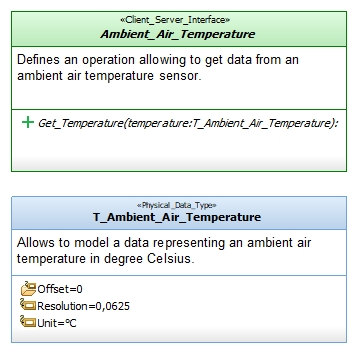

# Ambient_Air_Temperature_Interfaces
This packages gathers interfaces allowing to treat the data of an ambient air 
temperature sensor.

Modeled using the [Software_Model_Toolset](https://github.com/HomeMadeRobots/Software_Model_Toolset).

Implemented using the [Embedded_C_Framework](https://github.com/HomeMadeRobots/Embedded_C_Framework).

## Description

